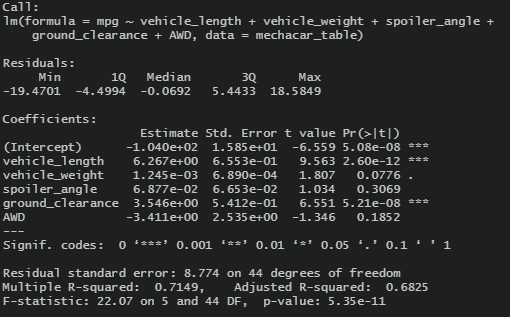
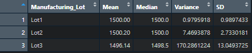

# MechaCar_Statistical_Analysis
## Linear Regression to Predict MPG

  
* Since the significance value we are applying to our analysis is α = 0.05, the p-values (Pr(<|t|) from table in image) with a value < 0.05 will reject the null hypothesis that the slope of the regression line is zero. The dependent variable in this regression analysis is the fuel economy (mpg) and the independent variables that provide a non-random amount of variance to the mpg are the vehicle lengths and ground clearance as seen in the image of the linear regression output using R. It should be mentioned that vehicle weight has a value slightly higher than α = 0.05 but still has provides some non-random variance to the mpg of the vehicles.   
Also, there are some variables that do not contribute to the mpg which are spoiler angle and whether or not the vehicle is all-wheel drive (AWD), since they have p-values higher than the significance level, failing to reject the null hypothesis that the slope equals zero.   

  
* The slope of the linear model does not equal zero since there are independent variables that contribute to the mpg of the vehicles. The image above provides the coefficients and y-intercept of the regression line using the lm() function in R.   
* This regression analysis does predict mpg of MechaCar prototypes effectively since it shows the independent variables that influence the mpg significantly. Also the Multiple R-squared value is 0.7149 which is greater than 0.7, indicating a strong correlation.   
## Summary Statistics on Suspension Coils
* Summary Statistics Table for all Manufacturing Lots:  

  
* Summary Stistics for each Manufacturing Lot:  

  
### The design specifications for the MechaCar suspension coils dictate that the variance of the suspension coils must not exceed 100 pounds per square inch (psi). Does the current manufacturing data meet this design specification for all manufacturing lots in total and each lot individually?
 
According to the statistics summary for each manufacturing lot, Lot3 shows a statistical variance that is greater than 100 psi with a value of 170.3. The variance is a measure of the spread of data in a dataset and is the average of squared deviations from the mean.
  
For all manufacturing lots, the variance does not exceed the 100 psi limit as shown by the summary statistics table for all manufacturing lots.