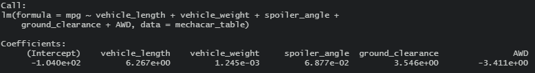

# MechaCar_Statistical_Analysis
## Purpose of analysis:
The following project provides a statistical analysis that addresses business questions for a car comppany's prototype vehicle called the MechaCar using **R programming language** and its **tidyverse** library that contains the **dplyr** package. 
## Linear Regression to Predict Fuel Economy (MPG) 

  

* Since the significance value we are applying to our analysis is α = 0.05, the p-values (Pr(<|t|) from table in image) with a value < 0.05 will reject the null hypothesis that the slope of the regression line is zero. The dependent variable in this regression analysis is the fuel economy (mpg) and the independent variables that provide a non-random amount of variance to the mpg are the vehicle lengths and ground clearance as seen in the image of the linear regression output using R. It should be mentioned that vehicle weight has a value slightly higher than α = 0.05 but still has provides some non-random variance to the mpg of the vehicles.   

* Also, there are some variables that do not contribute to the mpg which are spoiler angle and whether or not the vehicle is all-wheel drive (AWD), since they have p-values higher than the significance level, failing to reject the null hypothesis that the slope equals zero.   

  

* The slope of the linear model does not equal zero since there are independent variables that contribute to the mpg of the vehicles. The image above provides the coefficients and y-intercept of the regression line using the lm() function in R.   

* This regression analysis does predict mpg of MechaCar prototypes effectively since it shows the independent variables that influence the mpg significantly. Also the Multiple R-squared value is 0.7149 which is greater than 0.7, indicating a strong correlation.   

## Summary Statistics on Suspension Coils 
* Summary Statistics Table for all Manufacturing Lots:  

  

* Summary Statistics for each Manufacturing Lot:  

  

### The design specifications for the MechaCar suspension coils dictate that the variance of the suspension coils must not exceed 100 pounds per square inch (psi). Does the current manufacturing data meet this design specification for all manufacturing lots in total and each lot individually?
 

* According to the statistics summary for each manufacturing lot, Lot3 shows a statistical variance that is greater than 100 psi with a value of 170.3. The variance is a measure of the spread of data in a dataset and is the average of squared deviations from the mean.
  
* For all manufacturing lots, the variance does not exceed the 100 psi limit as shown by the summary statistics table for all manufacturing lots.  

## T-Tests on Suspension Coils 
Here, t-tests were performed to determine if all manufacturing lots and each lot individually are statistically different from the population mean of 1,500 pounds per square inch.  

* The null hypothesis for this t-test is that the mean of the samples is the same as the population mean i.e. Ho: μ = 1500 psi.
* The alternate hypothesis for this t-test is that the mean of the sample does not equal the mean of the population i.e. Ha: μ <> 1500 psi.
* The significan level for this t-test is α = 0.05.

### T-test for all manufacturing lots:  

  

* The p-value for suspension coil psi for all manufacturing lots is 0.06028 which is > the significance level. Therefore we fail to reject the null hypothesis that the mean of the samples is the same as the population mean i.e. the sample mean is equal to the population mean.   

### T-test for each manufacturing lot:  

**Lot 1:**  

  

* The p-value for suspension coil psi for manufacturing lot 1 is 1 which is > the significance level. Therefore we fail to reject the null hypothesis that the mean of the samples is the same as the population mean i.e. the sample mean is equal to the population mean.   

**Lot 2:**  

  

* The p-value for suspension coil psi for manufacturing lot 1 is 0.6072 which is > the significance level. Therefore we fail to reject the null hypothesis that the mean of the samples is the same as the population mean i.e. the sample mean is equal to the population mean.   

**Lot 3:**  

  

* The p-value for suspension coil psi for manufacturing lot 1 is 0.04168 which is < the significance level. Therefore we can reject the null hypothesis that the mean of the samples is the same as the population mean i.e. the sample mean is not equal to the population mean.    

## Study Design: MechaCar vs Competition 

* What metric/metrics can be tested?  

    1) The safety ratings for each vehicle type can be compared. 

    2) The average mpg for the competition's vehicles can be compared to that of MechaCar's.  

**The following information applies to i and ii above, respectively.**

* Null and alternate hypothesis for each metric to be tested:  

    1)  * Null hypothesis: There is no difference in frequency distribution between the safety ratings of the competition and MechaCar.  
        * Alternate hypothesis: There is a difference in frequency distribution between the safety ratings of the competition and MechaCar.   
    2)  * Null hypothesis: There is no statistical difference between the two observed sample means of Mechacar's mpg and the competition's. 
        * Alternate hypothesis: There is a statistical difference between the two observed sample means of Mechacar's mpg and the competition's. 

* What statistical test would you use to test the hypothesis? 

    1) A chi-squared tests can be performed to compare frequency distributions since the data being analyzed is categorical. 

    2) A two-sample t-test can be performed to compare means of two samples from separate populations (unpaired) since the input data is numerical and continuous.  

* What data is needed to run the statistical test?  

    1)  * Each subject within a group contributes to only one frequency, i.e. sum of all frequencies equals the total number of subjects in a dataset.  
        * Each unique value has an equal probability of being observed.  

    2)  * The input data is numerical and continuous.  
        * Each sample data was selected randomly from the population data.  
        * The input data is considered to be normally distributed. Each sample size is reasonably large. 
        * The sample data distribution should be similar to its population data distribution.  
        * The variance of the input data should be very similar. 